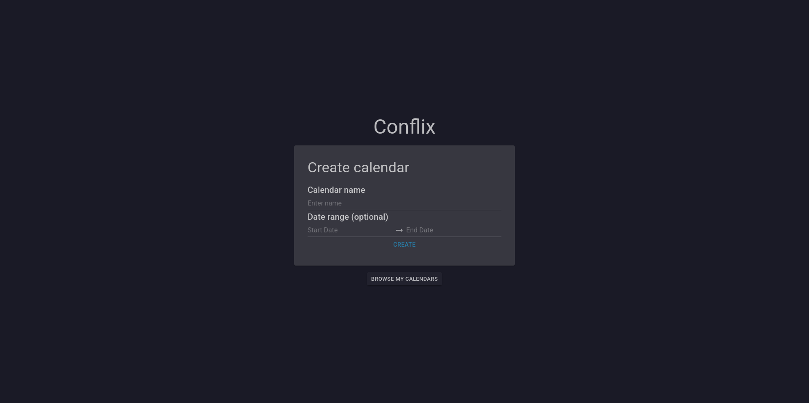
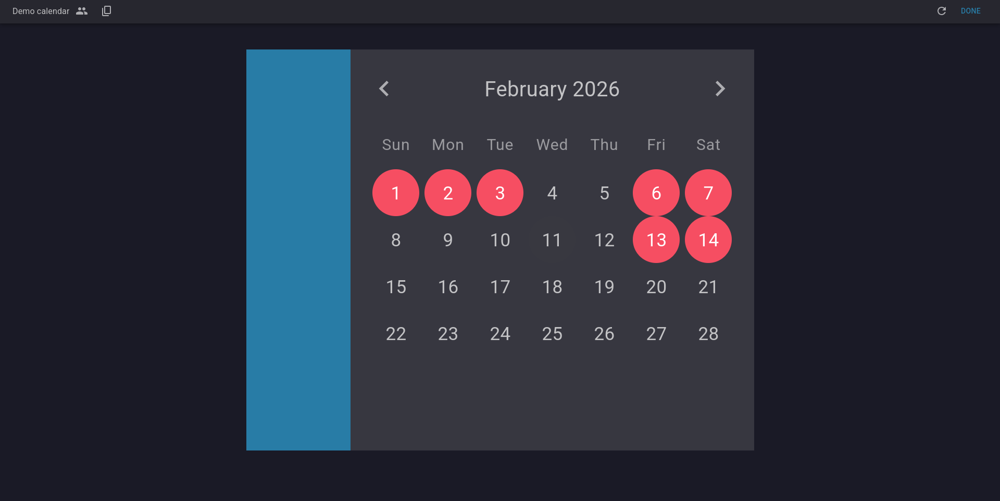
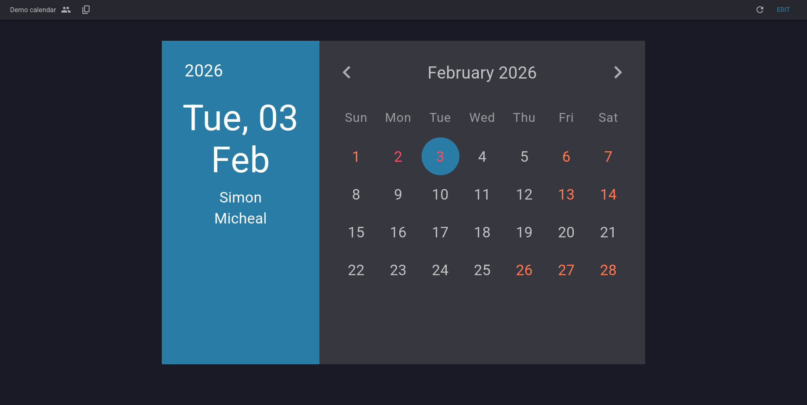
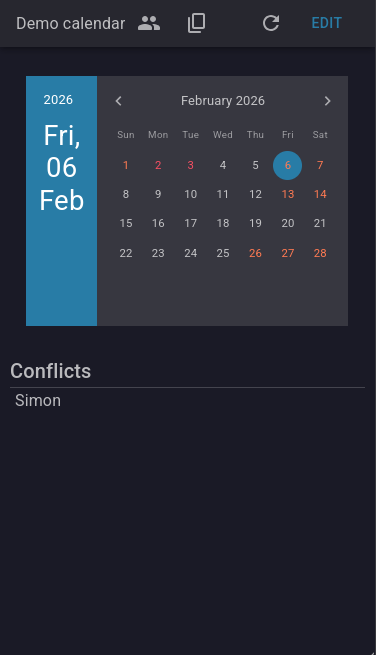

# Conflict Calendar

A quick and simple collaborative calendar to organise and schedule events.
Low friction as it requires no account.

## Hosting

This project is hosted on firebase servers at

```
  https://conflix-calendar.web.app/
```


## Tech Stack

**Front end:** Blazor, Mudblazor, 

**Server:** JSON.io database


## Demonstration
### Homepage


### Selecting busy days


### Coordinate with your friends


### Cross-platform support


